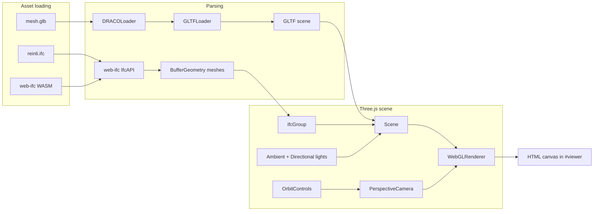

# Reinli Stavkyrkje

An interactive 3D web viewer for **Reinli stavkirke** — a stave church in Reinli, Sør-Aurdal, Norway. The app loads a BIM model in IFC format and a photogrammetry mesh, lets you orbit and zoom around the building, and click individual elements to inspect their IFC metadata.

The interface is in Norwegian.

## Features

- **Dual-model viewing** — A colored GLB mesh is shown by default; toggle the IFC BIM model on top with adjustable transparency.
- **Element inspection** — Click any IFC element to highlight it and open a property panel (type, name, description, and full property sets).
- **Camera controls** — Orbit, zoom, and pan via mouse or touch (`OrbitControls`).
- **Brightness control** — Adjust scene lighting with a slider.
- **Recenter** — Reset the camera to the default framing.
- **Responsive UI** — Desktop sidebar and mobile bottom sheet for the info panel.
- **Preloading** — IFC and GLB assets are preloaded in `index.html` for faster startup.

## Rendering & parsing stack

The viewer is built entirely in the browser. There is no server-side rendering — the server only serves static files.

| Tool | Role |
|------|------|
| **[Three.js](https://threejs.org/)** (`three`) | WebGL rendering via `WebGLRenderer`, scene graph, lights, materials, raycasting, and animation loop |
| **[web-ifc](https://github.com/ThatOpen/web-ifc)** | Parses IFC files in the browser using WebAssembly (`web-ifc.wasm`, `web-ifc-mt.wasm`, `worker.mjs`) |
| **Three.js `GLTFLoader`** | Loads the `mesh.glb` photogrammetry model |
| **Three.js `DRACOLoader`** + **Google Draco** | Decompresses Draco-compressed geometry inside the GLB (`public/draco/`) |
| **Three.js `OrbitControls`** | Camera interaction (rotate, zoom, pan) |
| **`MeshLambertMaterial`** | Shaded surfaces for IFC geometry, with per-color material sharing |
| **`THREE.Raycaster`** | Picking — maps clicks to IFC elements via mesh `expressID` |

### How models are rendered



1. **IFC (BIM model)** — `web-ifc` opens `public/models/reinli.ifc` with `COORDINATE_TO_ORIGIN: true`. `StreamAllMeshes` yields geometry that is converted to Three.js `BufferGeometry` with positions, normals, and indices. Each mesh stores its IFC `expressID` for selection. Materials are deduplicated by RGBA color.

2. **GLB (photogrammetry mesh)** — Loaded in parallel while IFC WASM initializes. The GLB is Z-up (Autodesk export); it is rotated to Y-up and aligned to the IFC bounding box (floor pinned on Y, centered on X/Z). Shown by default; the IFC group starts hidden.

3. **Rendering loop** — `renderer.setAnimationLoop` updates damped orbit controls and renders the scene each frame.

4. **Selection** — On click (not drag), a raycast against `pickableMeshes` finds the hit mesh, looks up the IFC line and property sets, and updates the info panel.

## Other tools

| Tool | Role |
|------|------|
| **[Vite](https://vite.dev/)** | Dev server, bundling, and production build |
| **[Bun](https://bun.sh/)** | Package manager, post-build gzip compression (`compress.js`), and production static file handler (`app.js`) |
| **Plain HTML/CSS** | Loader screen, overlays, info panel — no UI framework |

`elysia` and `@elysiajs/static` remain in `package.json` from an earlier setup but are **not used**; production serving is handled by the lightweight `app.js` fetch handler.

## Project structure

```
.
├── index.html          # Entry page, loader UI, asset preloads
├── main.js             # Three.js viewer, IFC/GLB loading, interaction
├── style.css           # UI styling (loader, panels, mobile layout)
├── vite.config.js      # Vite config (excludes web-ifc from dep optimization)
├── compress.js         # Post-build: gzip assets in dist/
├── app.js              # Production static file server with gzip support
└── public/
    ├── models/
    │   ├── reinli.ifc      # IFC BIM model (~3.6 MB)
    │   └── mesh.glb        # Draco-compressed photogrammetry mesh (~14 MB)
    ├── draco/              # Draco WASM decoder for GLTFLoader
    ├── web-ifc.wasm        # web-ifc single-threaded WASM
    ├── web-ifc-mt.wasm     # web-ifc multi-threaded WASM
    ├── worker.mjs          # web-ifc web worker bundle
    └── favicon.ico
```

## Getting started

### Prerequisites

- [Bun](https://bun.sh/) (recommended) or Node.js with a compatible package manager

### Install

```bash
bun install
```

### Development

```bash
bun run dev
```

Opens the Vite dev server (default `http://localhost:5173`). IFC, WASM, and model files are served from `public/`.

### Production build

```bash
bun run build
```

This runs `vite build` and then `compress.js`, which gzip-compresses JS, CSS, HTML, WASM, IFC, and GLB files in `dist/` for smaller transfers.

### Preview production build locally

```bash
bun run preview
```

### Production serving

`app.js` exports a default `reinli(request)` fetch handler that:

- Serves files from `dist/`
- Returns pre-compressed `.gz` variants when the client accepts `gzip`
- Sets cache headers (immutable for hashed Vite assets, one week for models/WASM)
- Falls back to `index.html` for SPA-style routing

It is designed to be mounted by an upstream router (e.g. as a submodule handler).

## Browser requirements

- **WebGL** — Required for Three.js rendering
- **WebAssembly** — Required for `web-ifc` IFC parsing
- **Safari 15+** — Older Safari versions lack reliable WASM support; the app shows a Norwegian error message if loading fails

## Configuration

| Constant | Location | Description |
|----------|----------|-------------|
| `DEBUG` | `main.js` | Set to `true` to show the IFC alignment debug panel (WASD keyboard nudging) |
| Model paths | `main.js`, `index.html` | `/models/reinli.ifc`, `/models/mesh.glb` |
| WASM path | `main.js` | `ifcApi.SetWasmPath("/", true)` — WASM files live in `public/` |

## License

ISC (see `package.json`).

## Links

- [Reinli stavkyrkje on kirken.no](https://www.kirken.no/nb-NO/fellesrad/Sor-Aurdal/om-oss/kirkene-vare/reinli-stavkyrkje/)
- [Repository](https://github.com/hallvardnmbu/bim)
